# UniFileManager

> File management for Laravel Filament.

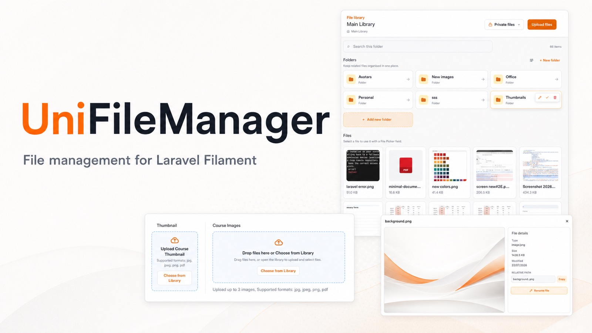

UniFileManager adds a full file-library experience to Filament. It includes a
File Manager page for working with files and folders, plus `UniFilePicker` for
selecting files from Filament forms. Files always remain within configured
storage-area roots, whether you use private application files or public website
media.

## Contents

- [Version compatibility](#version-compatibility)
- [Features](#features)
- [Requirements](#requirements)
- [Installation](#installation)
- [Quick start](#quick-start)
- [Storage areas](#storage-areas)
- [S3, R2, and MinIO](#s3-r2-and-minio)
- [UniFilePicker](#unifilepicker)
- [Uploads, previews, and thumbnails](#uploads-previews-and-thumbnails)
- [Configuration](#configuration)
- [Translations](#translations)
- [Styling and assets](#styling-and-assets)
- [Access control and storage](#access-control-and-storage)
- [Screenshots](#screenshots)
- [Development](#development)

## Version compatibility

| Laravel | Filament | Livewire | PHP |
| --- | --- | --- | --- |
| 11.x | 4.x, 5.x | 3.x, 4.x | 8.2+ |
| 12.x | 4.x, 5.x | 3.x, 4.x | 8.2+ |
| 13.x | 4.x, 5.x | 3.x, 4.x | 8.2+ |

The GitHub Actions workflow verifies every Laravel and Filament combination in
this table.

## Features

- **File Manager page** — browse folders, upload files, move or rename items,
  download files, and delete one or many selected items.
- **UniFilePicker** — choose one or many files from a focused library modal or
  upload them directly from a Filament form.
- **Private and public media** — keep application files and public website
  media in separate, server-defined storage areas.
- **File previews** — view images, PDFs, and text files. Image previews include
  useful file properties and public files can expose a copyable URL.
- **Image thumbnails** — create lightweight thumbnails for supported images,
  with a generic fallback when a thumbnail is unavailable.
- **Organised browsing** — breadcrumbs, search, sorting, optional folders-first
  layout, and pagination for large libraries.
- **Field-level limits** — restrict picker MIME types, target a directory, set
  file limits, and choose compact or image-card multiple-file views.
- **Theme-aware UI** — controls inherit the active Filament panel primary colour
  without requiring a custom theme or Node build.

## Requirements

- PHP 8.2 or later
- Laravel 11, 12, or 13
- Filament 4 or 5
- Livewire 3 or 4
- PHP GD is optional, but required for generated image thumbnails

## Installation

Install the package and publish its configuration:

```bash
composer require unifilemanager/filament-file-manager:"^0.7.2"
php artisan vendor:publish --tag=filament-file-manager-config
```

When updating from an older version, allow Composer to update related package
dependencies as well:

```bash
composer update unifilemanager/filament-file-manager --with-all-dependencies
```

Register the plugin in your Filament panel provider:

```php
use Filament\Panel;
use UniFileManager\FilamentFileManager\FilamentFileManagerPlugin;

public function panel(Panel $panel): Panel
{
    return $panel->plugins([
        FilamentFileManagerPlugin::make(),
    ]);
}
```

You may customize the File Manager navigation item from the plugin:

```php
FilamentFileManagerPlugin::make()
    ->navigationLabel('Files')
    ->navigationGroup('Content')
    ->navigationSort(10)
    ->navigationIcon('heroicon-o-folder')
    ->shouldRegisterNavigation(fn (): bool => auth()->user()?->can('manage files') ?? false);
```

For deeper page customization, register your own page class that extends the
package File Manager page:

```php
use App\Filament\Pages\CustomFileManager;

FilamentFileManagerPlugin::make()
    ->page(CustomFileManager::class);
```

Publish the package's registered Filament assets after installing or updating:

```bash
php artisan filament:assets
```

## Quick start

The File Manager uses Laravel's `manageFileManager` ability by default. Define
that ability in your application, for example in `AppServiceProvider::boot()`:

```php
use App\Models\User;
use Illuminate\Support\Facades\Gate;

Gate::define('manageFileManager', function (User $user): bool {
    return $user->is_admin === true;
});
```

Replace the example condition with your own permission system. If your user
model does not have an `is_admin` attribute, use an existing role or permission
check instead. Users granted the ability can open the **File Manager** page from
your Filament navigation.

For tenant-specific access, implement the core `FileManagerAuthorizer` and a
request-aware `StorageAreaResolver`. See the [multi-tenancy guide](docs/multi-tenancy.md)
for a working pattern.

## Storage areas

UniFileManager uses named storage areas. The browser can choose an enabled area,
but never supplies its disk, root, or visibility settings.

Private storage is enabled by default. Enable public media only when you have a
public disk or CDN configured deliberately:

```php
'storage_areas' => [
    'private' => [
        'enabled' => true,
        'disk' => 'local',
        'root' => 'file-manager/private',
        'visibility' => 'private',
    ],
    'public' => [
        'enabled' => true,
        'disk' => 'public', // Or an S3/R2 disk configured for public delivery.
        'root' => 'file-manager/public',
        'visibility' => 'public',
    ],
],
```

S3-compatible disks work through Laravel's filesystem configuration. See the
[S3, R2, and MinIO guide](docs/s3-compatible-storage.md) for production
examples.

When more than one area is enabled, File Manager displays a storage-area
switcher. The user's last selection is remembered for their current session.
Items from different areas are never mixed in one directory listing.

For multi-tenant applications, replace the static storage-area configuration
with a trusted request-aware resolver. Do not derive a disk or root from browser
input. See the [multi-tenancy guide](docs/multi-tenancy.md).

### Private files and public media

Use the private area for documents, invoices, and customer uploads. Use the
public area for assets that visitors may access directly, such as course images
or blog thumbnails.

File Manager administration still requires permission in either area. A public
asset URL, however, does not require access to the File Manager page.

## S3, R2, and MinIO

UniFileManager supports private and public storage areas on Laravel disks backed
by Amazon S3, Cloudflare R2, MinIO, or another S3-compatible service. Configure
the disk in `config/filesystems.php`, then point a storage area at that server
defined disk and root. Do not accept disk, bucket, endpoint, or root values from
the browser.

Read the full [S3-compatible storage guide](docs/s3-compatible-storage.md) for
environment examples, private/public area configuration, MinIO endpoint notes,
and integration-test coverage.

## UniFilePicker

`UniFilePicker` stores relative paths below the selected storage-area root. It
is the preferred form component; `FilePicker` remains available as a
backward-compatible alias.

### Single-file fields

```php
use UniFileManager\FilamentFileManager\Filament\Forms\Components\UniFilePicker;

UniFilePicker::make('thumbnail')
    ->publicMedia()
    ->directory('courses/thumbnails')
    ->allowedMimeTypes(['image/*']);
```

After a file is selected, the drop area becomes a responsive file card. Hover
the card to remove the selection. Use Filament's normal `->helperText(...)`
method to add guidance beneath the drop area.

Change the placement-box copy when the default wording does not suit the field:

```php
UniFilePicker::make('thumbnail')
    ->uploadHeading('Add the course thumbnail')
    ->uploadDescription('Drop an image here or choose one from the library.');
```

### Multiple-file fields

```php
UniFilePicker::make('gallery')
    ->multiple()
    ->maxFiles(10)
    ->clearable();
```

Multiple fields use a compact list with small thumbnails by default. Use larger
cards for image galleries:

```php
UniFilePicker::make('gallery')
    ->multiple()
    ->imageCardView();
```

The upload area remains visible while there is room for another file. It hides
at the configured limit and returns when a file is removed. Multiple selections
can be cleared together with the **Clear selection** action.

### File type, directory, and duplicate rules

By default, a picker accepts JPEG, PNG, WebP, GIF, PDF, plain text, DOC, and
DOCX files. Use `allowedMimeTypes()` to narrow the types accepted by one field:

```php
UniFilePicker::make('invoice')
    ->privateMedia()
    ->directory('invoices')
    ->allowedMimeTypes(['application/pdf']);
```

The directory applies to browsing, uploads, file selection, and parent-folder
navigation. It must be below the selected storage-area root. Stored values
remain relative to that root, for example `courses/thumbnails/cover.jpg`.

Duplicate selections are blocked by default. Enable them only where the same
library file may be intentionally selected more than once:

```php
UniFilePicker::make('slides')
    ->multiple()
    ->maxFiles(10)
    ->allowDuplicateSelection();
```

Each duplicate counts toward `maxFiles()` and can be removed independently.

### Library behaviour

The embedded file library is enabled by default. It provides folder navigation,
search, sorting, item-layout controls, pagination, previews, and automatic
uploads. It deliberately omits File Manager administration actions such as
renaming and deletion.

Disable the library for a field with `->library(false)`, or disable it for every
field with `file_picker_library` in the package configuration.

If only one storage area is enabled, the picker uses it automatically. When both
areas are enabled, configure `file_picker_default_area` or choose the intended
area explicitly with `->privateMedia()`, `->publicMedia()`, or
`->storageArea('area-name')` for a custom server-defined storage area.

### Spatie Media Library collections

`UniFilePicker` can sync selected files into a
`spatie/laravel-medialibrary` collection instead of dehydrating a path into a
model column:

```php
UniFilePicker::make('gallery')
    ->multiple()
    ->storageArea('public')
    ->collection('gallery');
```

The model must implement Spatie's `HasMedia` contract. The field stores media
rows that point at files already managed by UniFileManager, so removing a
selection unlinks the media row and does not delete the underlying file.

Install `spatie/laravel-medialibrary` before calling `collection()`. When your
storage area uses a root prefix, configure your media-library path generator to
honour the `external_dir` custom property written by this field; otherwise
Spatie will resolve those media rows to its default id-based paths instead of
the existing file-manager objects.

## Uploads, previews, and thumbnails

Uploaded files keep their safe client filename. Existing files are never
overwritten: a collision becomes `filename (2).ext`, then `filename (3).ext`.
Normal filename characters such as spaces, Unicode, `+`, parentheses,
underscores, and hyphens are retained. Cross-platform-unsafe characters are
normalised during upload.

Files selected through File Manager or UniFilePicker upload immediately. Set
the package-wide upload count with `max_upload_files` (default: `10`). The
package also respects PHP's `max_file_uploads` limit.

Image, PDF, and plain-text previews are available through the package preview
route. Image previews show the file type, size, modified date, and relative
path. Public-media images also include a copyable public URL.

Image thumbnails are generated with PHP GD and stored in an internal
`.thumbnails` directory. If GD is unavailable, or an image exceeds
`thumbnails.max_source_pixels` (default: `8,000,000`), the package uses a
lightweight generic image tile instead. Thumbnail generation is synchronous and
does not need Laravel queue configuration.

## Configuration

Publish the config file first, then change only the values your application
needs:

```bash
php artisan vendor:publish --tag=filament-file-manager-config
```

| Setting | Default | Purpose |
| --- | --- | --- |
| `max_upload_size` | `10240` KiB | Maximum upload size |
| `max_upload_files` | `10` | Maximum files accepted in one upload |
| `folders_per_page` | `10` | Folder page size in folders-first layout |
| `files_per_page` | `10` | File page size in folders-first layout |
| `items_per_page` | `20` | Page size when all items are together |
| `max_directory_depth` | `7` | Folder levels below the configured root |
| `show_item_layout` | `false` | Show the folders-first and all-items-together control |
| `storage_area_resolver` | `ConfigStorageAreaResolver::class` | Resolves storage areas for the current server-side context |
| `preview_rate_limit` | `60` | Preview and thumbnail requests per minute |
| `thumbnails.max_source_pixels` | `8000000` | Largest source image considered for thumbnail generation |

The File Manager and File Picker Explorer show all items together by default.
Set `show_item_layout` to `true` when users should be able to choose **Folders
first**. Their choice is remembered for the current session.

`file_picker_manager_url` is retained only for legacy integrations. It is `null`
by default because panel URLs vary by application. A field can override it with
`->managerUrl('/custom-file-manager')`; this does not open a new tab.

## Translations

UniFileManager uses Laravel's namespaced translations for File Manager and
UniFilePicker labels, dialogs, upload feedback, and notifications. English is
included by default. Publish the file before adding another locale:

```bash
php artisan vendor:publish --tag=filament-file-manager-translations
```

For example, add French translations in
`lang/vendor/filament-file-manager/fr/file-manager.php`. Laravel selects the
package strings using your application's active locale.

## Styling and assets

The package ships with its own scoped stylesheet. It does not require a custom
Filament theme, Tailwind configuration, or Node.js build in the consuming
application. Buttons, links, focus states, upload states, pagination, and
picker selection indicators inherit the active panel primary colour.

Run this command during deployment after installing or updating the package:

```bash
php artisan filament:assets
```

The stylesheet is loaded in Filament's document head to avoid an unstyled flash
when opening File Manager.

## Access control and storage

- The default area uses Laravel's private `local` disk. It refuses the standard
  `public` disk and local roots below `public/` or `storage/app/public` when an
  area is configured as private.
- S3-compatible private areas are supported when the Laravel disk is private
  and the storage-area root is server-defined. Public S3-compatible areas should
  use a dedicated public bucket/prefix or CDN URL. See the
  [S3-compatible storage guide](docs/s3-compatible-storage.md).
- Replace the default `manageFileManager` check with application-specific core
  `FileManagerAuthorizer` and `StorageAreaResolver` classes when access depends on
  tenants or paths. Read the [multi-tenancy guide](docs/multi-tenancy.md)
  before enabling the package in a tenant application.
- Keep the package MIME and extension lists narrow for your use case. The
  picker can apply a narrower list with `allowedMimeTypes()`.
- The configured root cannot be renamed, moved, or deleted. A folder cannot be
  moved into itself or one of its descendants.
- Preview and thumbnail responses require authentication, are rate-limited per
  user or guest IP address, and send private no-store and `nosniff` headers.
- Add malware scanning in your application before making new uploads available
  to other users.

If you are upgrading from an earlier public-disk configuration, follow the
[upgrade notes](docs/upgrading.md) before deployment.

## Screenshots

<details>
<summary>View File Manager and UniFilePicker screenshots</summary>

### File Manager overview

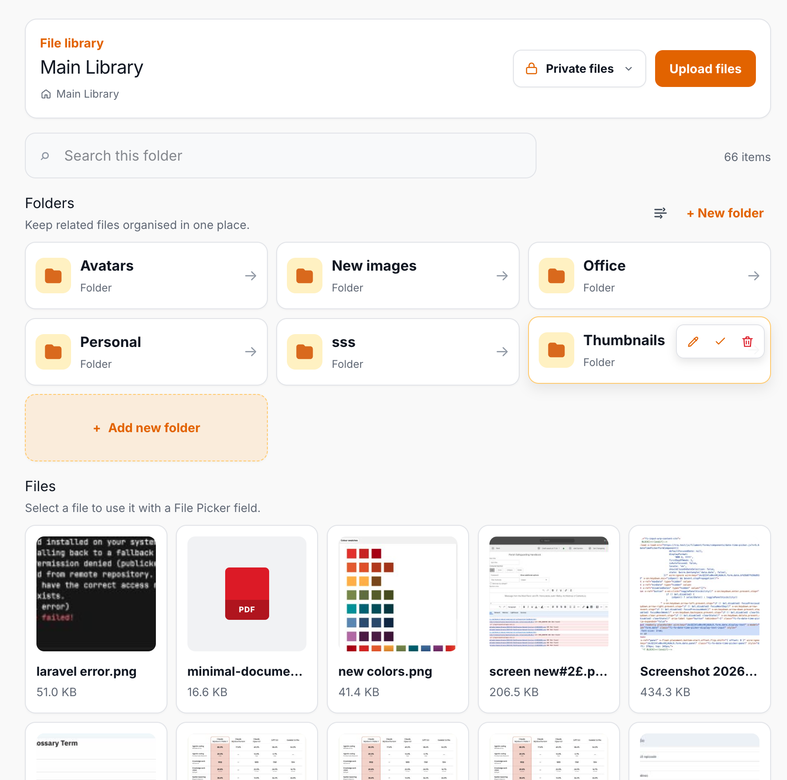

### Browse files and folders

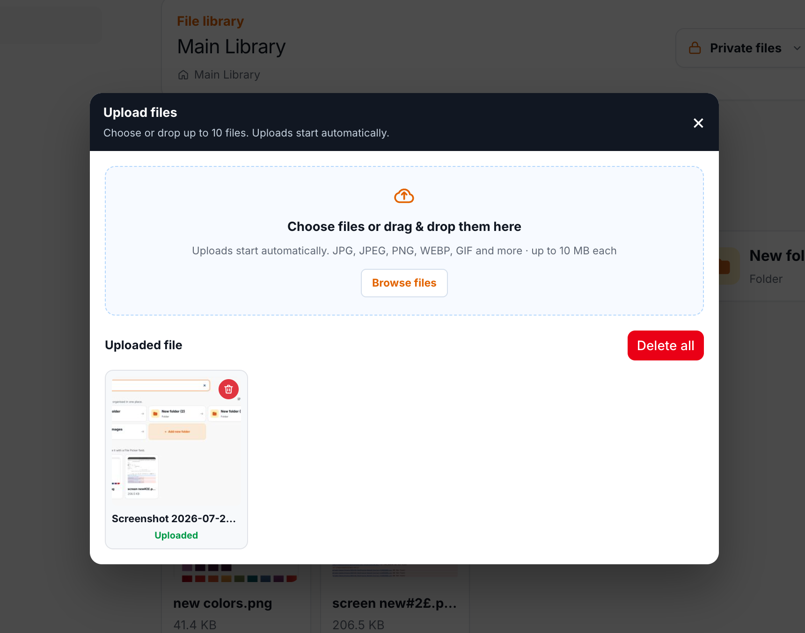

### Upload files

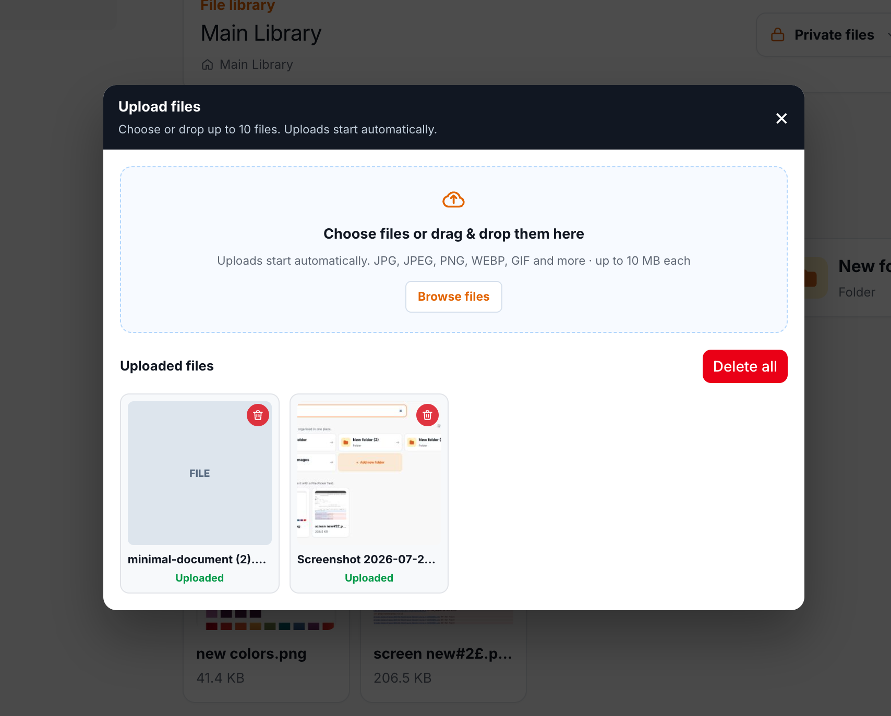

### Image preview and file details

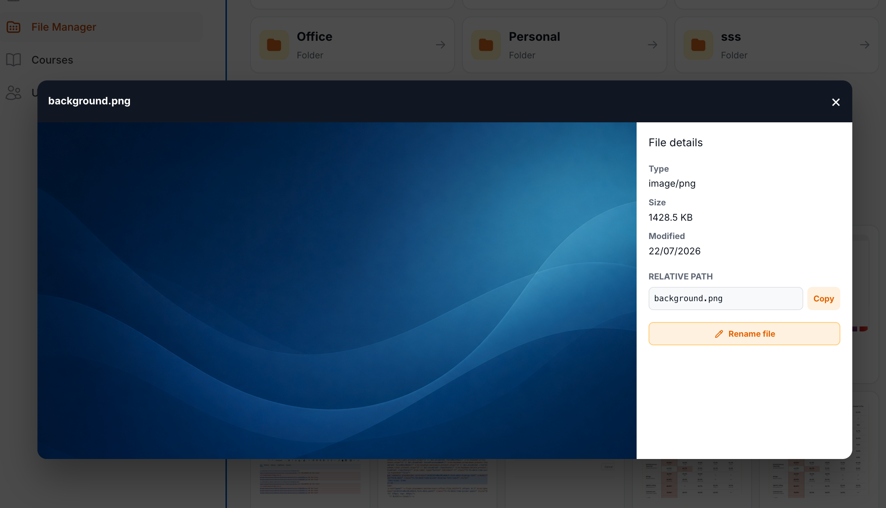

### Public and private storage areas

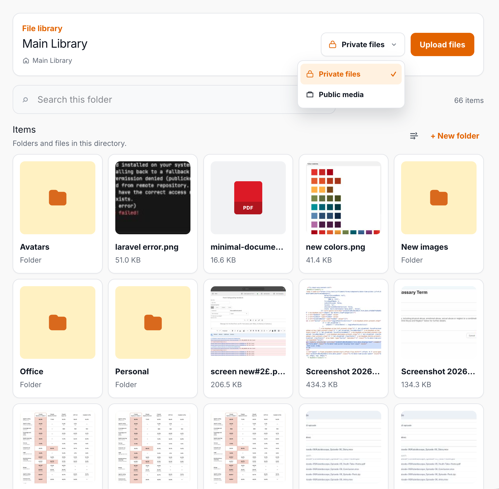

### Item layout and sorting

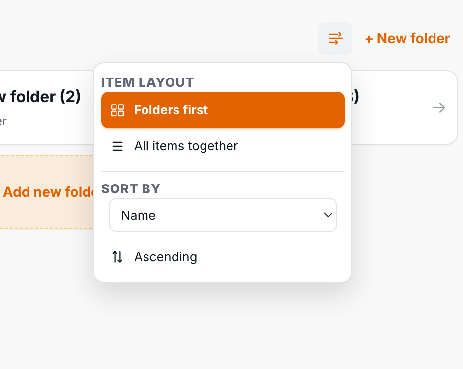

### Folders-first layout

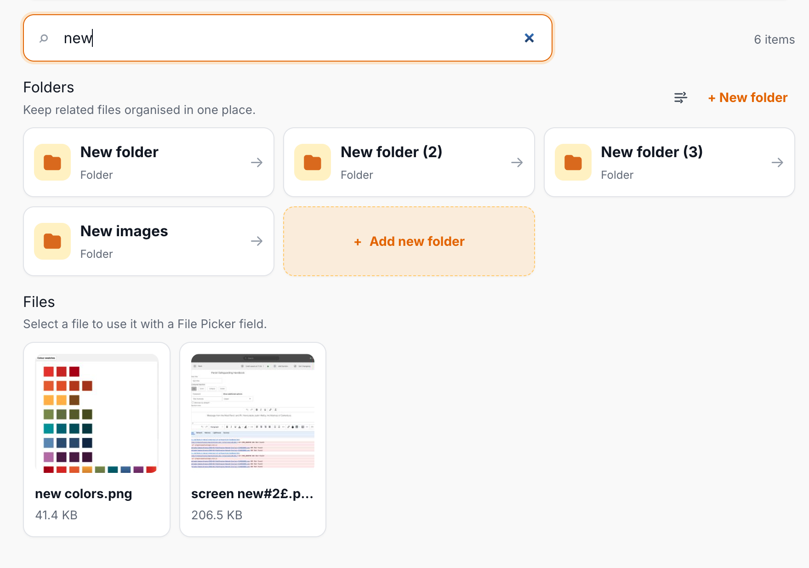

### Separate pagination for folders and files

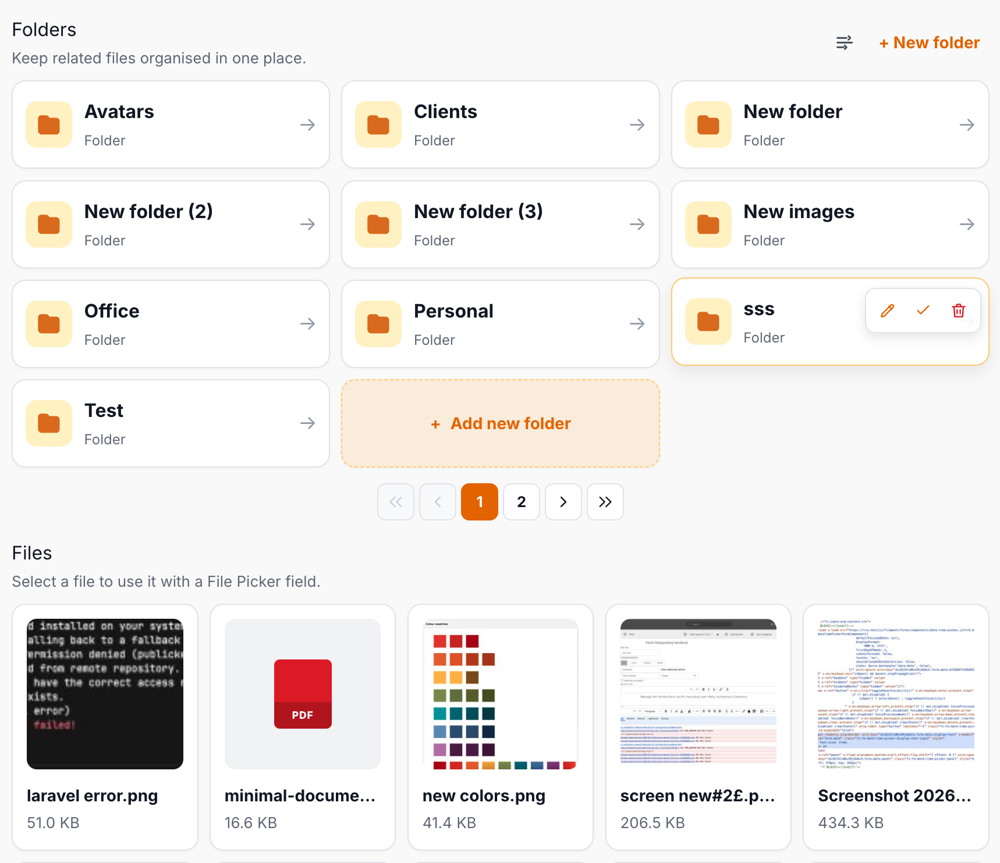

### Bulk delete

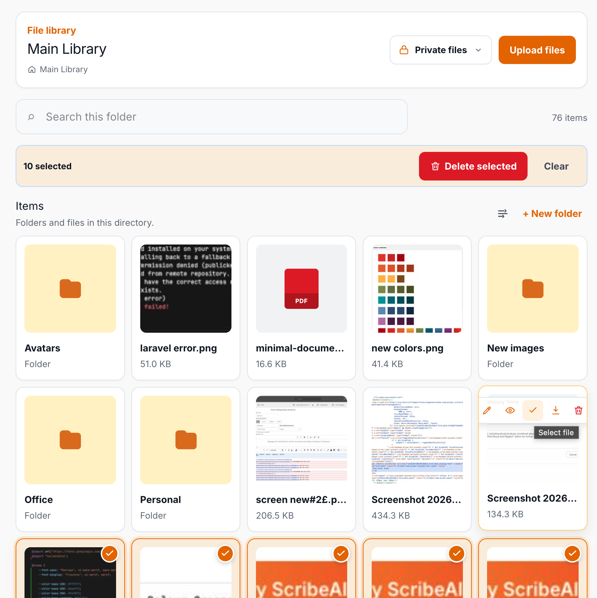

### UniFilePicker

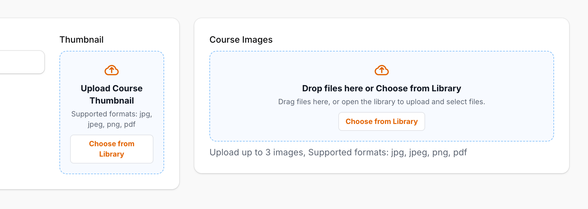

### Selected files in UniFilePicker

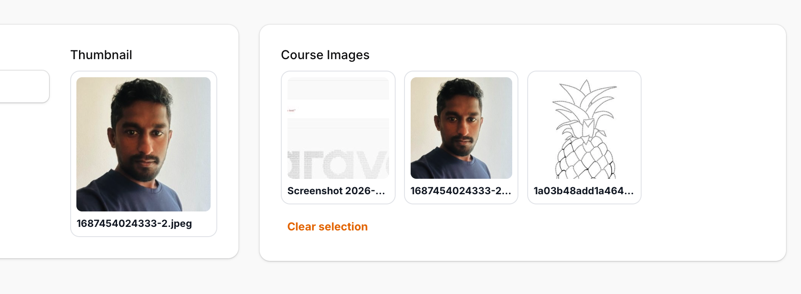

### Choose files from the library

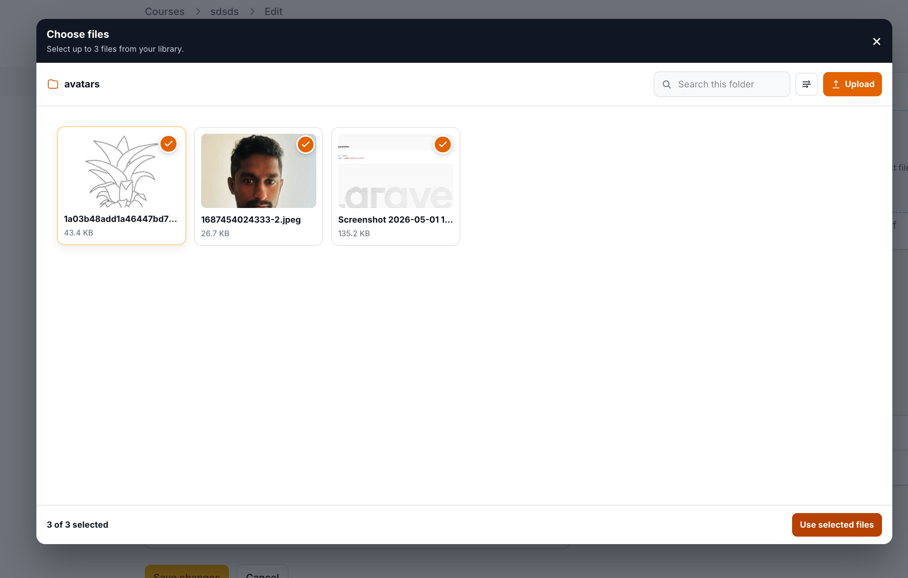

</details>

## Development

Run the formatting check and package tests before opening a pull request:

```bash
composer lint
composer test
```

Use `composer format` to apply the package's PSR-12 formatting rules.

## Project documents

- [Changelog](CHANGELOG.md)
- [Upgrade notes](docs/upgrading.md)
- [Multi-tenancy guide](docs/multi-tenancy.md)
- [S3-compatible storage guide](docs/s3-compatible-storage.md)
- [Release policy](docs/releasing.md)
- [MIT License](LICENSE)

## Maintainer

UniFileManager is maintained by Sampath Arachchige.
